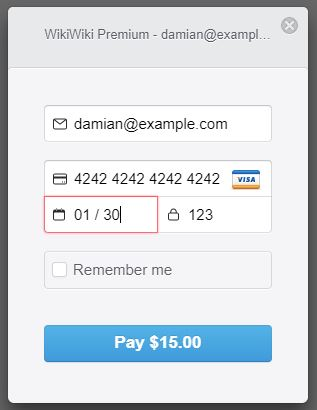
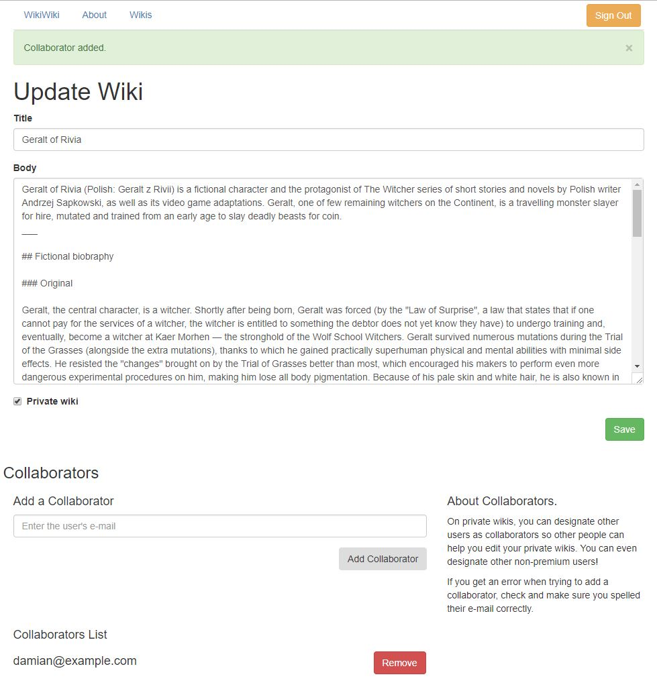

# WikiWiki

A wiki built with Ruby on Rails.

**Visit https://my-wikiwiki-app.herokuapp.com/**

### For the full experience, upgrade to premium!

Create an account and click on your e-mail in the top-right corner and click on "Upgrade." It's in testing mode, so as long as you enter "4242 4242 4242 4242" as the credit card number and a future expiration date it will go through successfully.

Now you can create your own private wikis that only you can see! Also, you can add collaborators to your private wikis which will grant them the rights to view and edit your private wikis alongside you.

Give it a shot, create a private wiki and add `damian@example.com` as a collaborator. Or create a second account and add it. I added logic to the backend that lets non-premium users view and edit private wikis as long as they are collaborators :)

